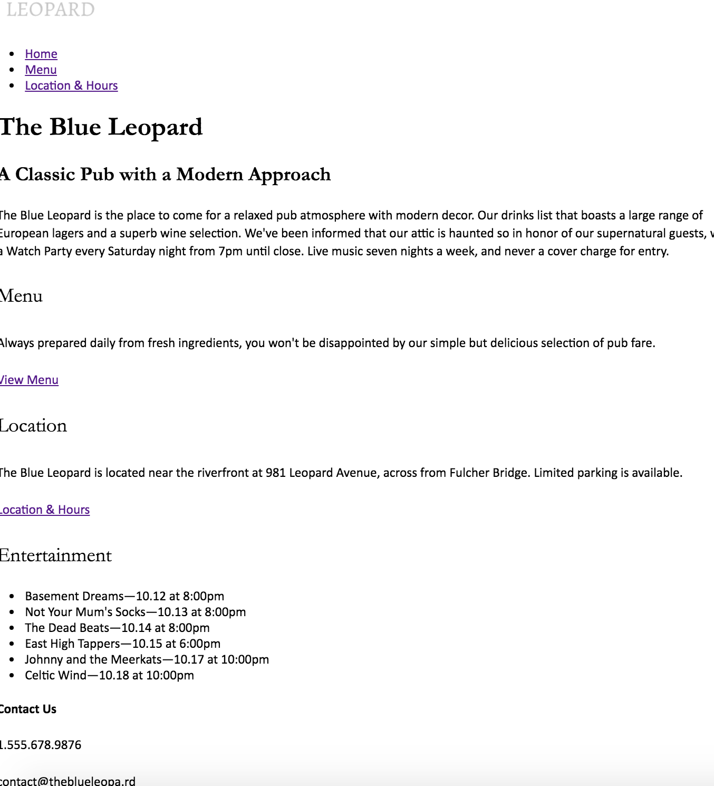
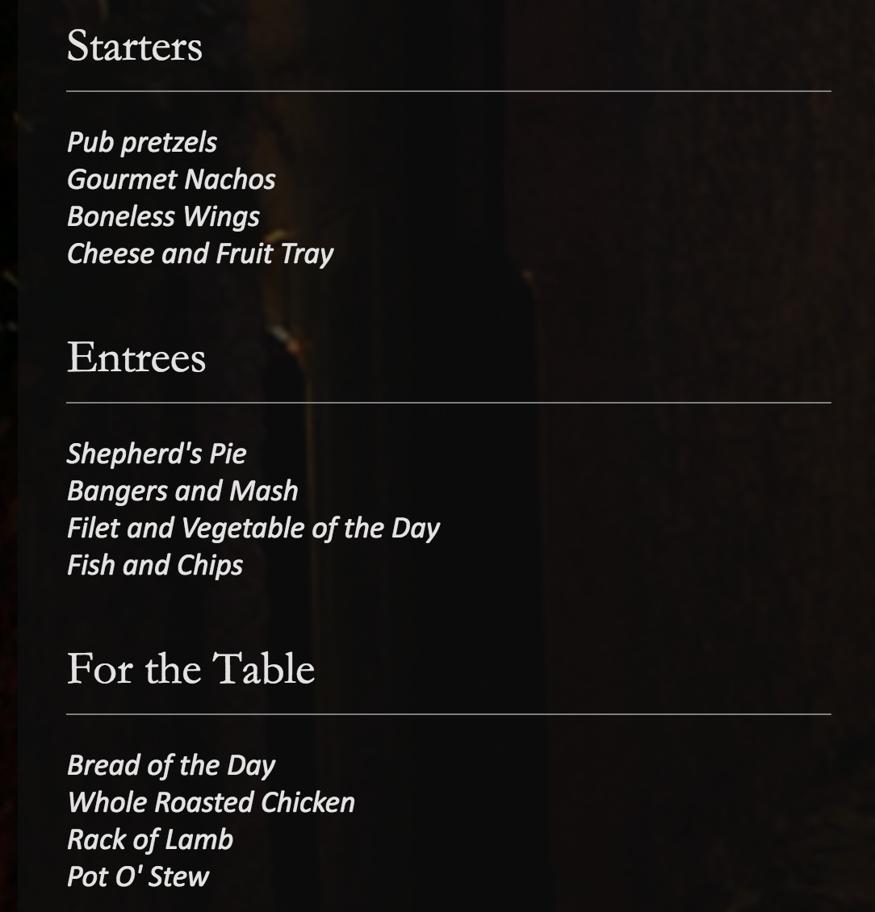

#Website Layout Notes 

##These notes cover the process of implementing a website. Each of these versions contain 3 pages: index.html, location.html and menu.html. Material originally from PluralSight. 

###07_begin: No styles added. Routing to different pages implemented using

```
<p><a href="menu.html">View Menu</a></p>
```

###11_begin: added unstyled nav bar using 

```
    <nav>
      <ul>
        <li><a href="index.html">Home</a></li>
        <li><a href="menu.html">Menu</a></li>
        <li><a href="location.html">Location &amp; Hours</a></li>
      </ul>
    </nav>
```

###12_begin: added logo into the header tag
```
 <a href="index.html"></a>
```

and began putting images in. they resume the original size at this point
```
  <div>
    
    
    
    
  </div>
```

###13_begin: fonts are beginning to look nicer and normalize.css is added to every page

```
  <link href="styles/main.css" rel="stylesheet">
  <link href="styles/normalize.css" rel="stylesheet">
```

###15_begin: we begin styling the headers


notice that h1's font size is 3.3ems and the p's font size is 1em. margin-bottom's are set to 0.

```
body {
  font-size: 19px;
  font-family: "cronos-pro", calibri, candara, "segoe UI", Optima, Arial, sans-serif;
}

h1, h2, h3 {
  font-family: "double-pica-sc", Garamond, "Baskerville Old Face", "Times New Roman", serif;
}

h1 {
  font-size: 3.3684em;
  line-height: 1.2656em;
  margin-top: 0.4219em;
  margin-bottom: 0;
}

h2 {
  font-size: 1.5em;
  line-height: 1.2558em;
  margin: 0.4219em auto 0.4219em auto;
}

h3 {
  font-size: 1.5263em;
  font-weight: normal;
  line-height: 1.8621em;
  margin-top: 0.9310em;
  margin-bottom: 0;
}

p {
  font-size: 1em;
  line-height: 1.4211em;
  margin-top: 1.4211em;
  margin-bottom: 0;
}
```

###16_begin: starting to play with the images 

```
img {
  width: 100%;
}

```

###17_begin: adding colors to the links


```
a:link {
  color: rgb(172,140,71);
}

  a:visited {
    color: rgb(100, 81, 41);
  }

  a:hover {
    color: rgb(224, 182, 90);
  }

  a:active {
    color: rgb(252, 217, 142);
  }
```
style to all caps
```
  footer h4 {
    text-transform: uppercase;
  }

```


###21_begin: added background image but the image isn't scaled properly yet and modified font colors
```
body {
  font-size: 19px;
  font-family: "cronos-pro", calibri, candara, "segoe UI", Optima, Arial, sans-serif;
  color: rgb(226,226,226);
  background: rgb(15,15,15);
  background-image: url(../images/background.jpg);
  background-repeat: no-repeat;
  background-size: cover;
}
```

###24_begin: create translucent div container for the content in the page

```
.container {
  background: rgb(15,15,15); /* IE8 */
  background: rgba(15,15,15,0.74);
  padding: 30px;
}

```

###25_begin: minimize the logo to a reasonable size
```
.logo {
  display: block;
  margin: 0 auto;
  width: 150px;
}

  .logo img {
    width: 150px;
  }
```

###26_begin: navigation menus


```
.main-navigation ul {
  padding-left: 0;
}

.main-navigation li {
  list-style: none;
  text-align: center;
  margin: 20px 0;
}

.main-navigation a {
  display: block;
  padding: 15px 10px;
  text-decoration: none;
  text-transform: uppercase;
  background: rgba(67,67,67,0.17);
  color: rgb(180,180,180);
}
```

###28_begin: navigation menus hover effects- fonts change color as well as the box's color

```
.main-navigation ul {
  padding-left: 0;
}

.main-navigation li {
  list-style: none;
  text-align: center;
  margin: 20px 0;
}

.main-navigation a {
  display: block;
  padding: 15px 10px;
  text-decoration: none;
  text-transform: uppercase;
  background: rgba(67,67,67,0.17);
  color: rgb(180,180,180);
}

  .main-navigation a:visited {
    color: rgb(106,106,106);
  }

  .main-navigation a:hover {
    color: rgb(255,255,255);
    transition: .5s color;
    background: rgba(62, 61, 61, 0.51);
  }

  .main-navigation a:active {
    color: rgb(172,140,71);
  }
```

###30_begin: styling buttons to fill the length of the div

```
.button {
  background-color: rgb(172,140,71);
  border-radius: 8px;
}

  .button a {
    color: rgb(226, 226, 226);
    text-decoration: none;
    font-style: normal;
    text-transform: uppercase;
    text-align: center;
    display: block;
    padding: 10px 0;
  }

  .button a:hover {
    background-color: rgb(119, 97, 48);
    border-radius: 8px;
  }

```

###32_begin: add a divider line for the headers

```
.featured-info h3 {
  border-bottom: 1px solid rgb(128,128,128);
}

.featured-info p {
  font-style: italic;
}

.featured-info ul {
  list-style: none;
  padding-left: 0;
}
```

###36_begin: media queries galore!

make fonts slightly bigger when it's 750px and lower
```
@media screen and (min-width: 750px){
  body {
    font-size: 1.4em;
  }
}
```

put the lists into three columns if it's a screen no smaller than 1050px

```
@media screen and (min-width: 1050px){
  .featured-info {
    float: left;
    width: 30%;
    margin-left: 3%;
  }
}
```

make the landing page text centered if it's a tablet or larger 
```
@media screen and (min-width: 750px) {
  
  .landing {
    text-align: center;
  }
  
}
```

create a nav bar instead of using buttons
```
@media screen and (min-width: 750px){
  
  .main-navigation {
    min-height: 100px;
    border-top: 1px solid rgb(36,36,36);
    border-bottom: 1px solid rgb(36,36,36);
  }
  
  .main-navigation ul {
    max-width: 950px;
    margin: 0 auto;
  }
  
    .main-navigation li {
      float: left;
      margin-left: 20px;
      width: 28%;
    }
  
    .main-navigation a {
      background: none;
    }
  
      .main-navigation a:hover {
        background: none;
      }
} /* media query for 750px  */

@media screen and (min-width: 880px){
  
  .main-navigation ul {
    position: relative;
    right: -30px ;
  }
  
}/* media query for 880px  */
```
###40_begin: 

gallery: set wrapper to 567px and center the images. since we want two images to fit in each row, set the images to be a little less than 560/2 = 280px
```
@media screen and (min-width: 1050px) {
  
  .gallery {
    width: 567px;
    margin-left: auto;
    margin-right: auto;
  }
  
    .gallery img {
      max-width: 280px;
    }
   
}
```
Open index.html to view the results!
